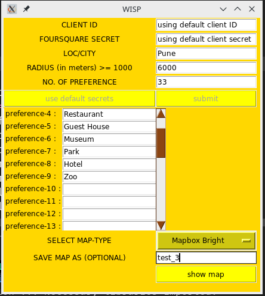
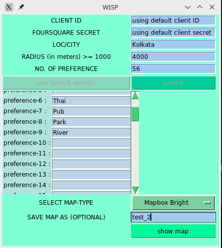
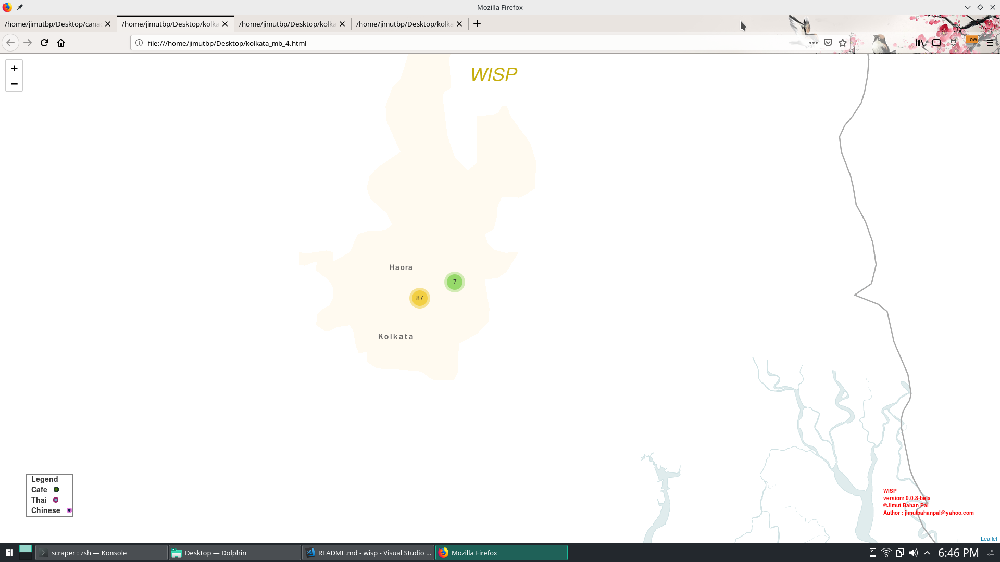
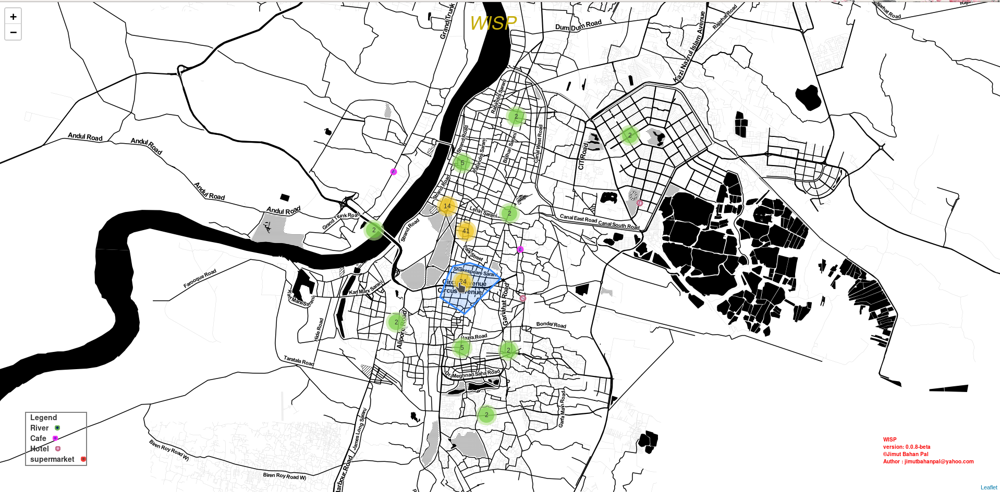
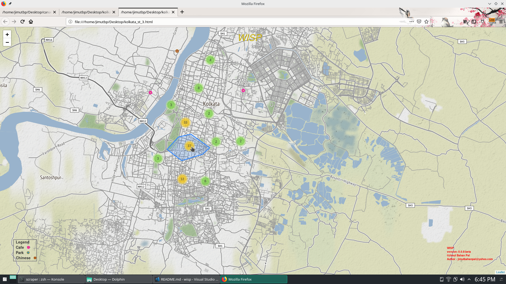
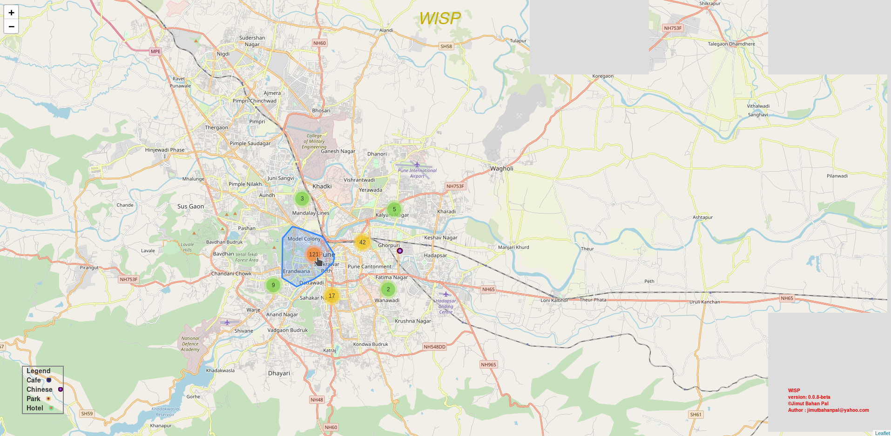
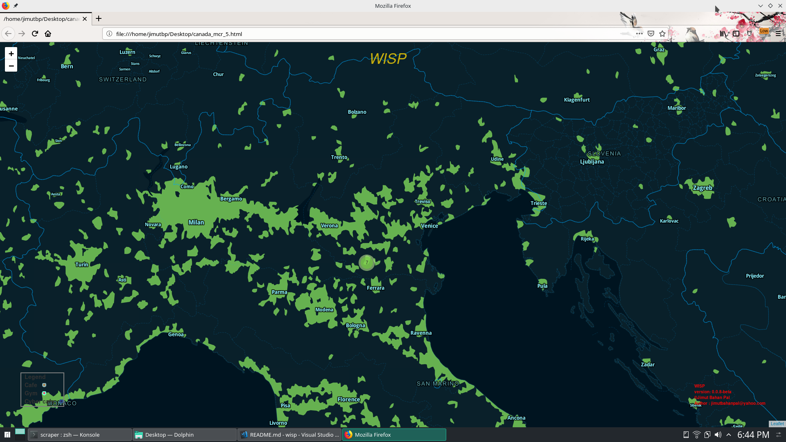
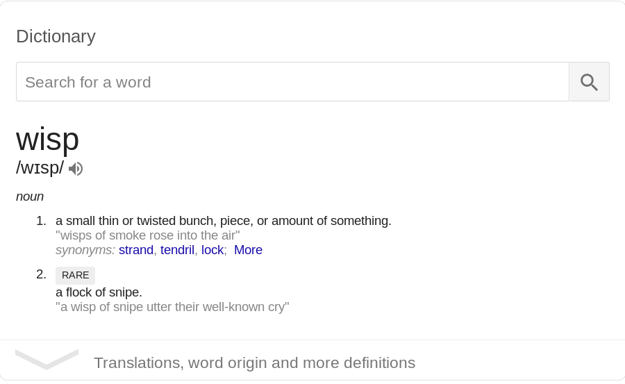
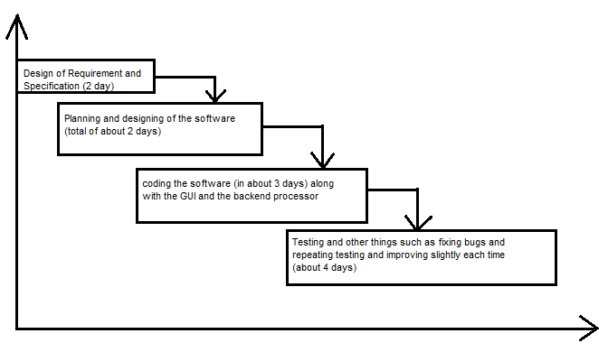
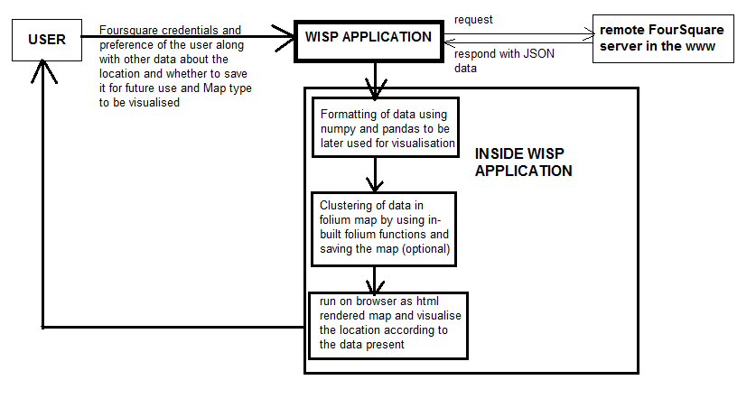

# Wisp : A preference based location finder app


```
██╗    ██╗██╗███████╗██████╗       
██║    ██║██║██╔════╝██╔══██╗       
██║ █╗ ██║██║███████╗██████╔╝        
██║███╗██║██║╚════██║██╔═══╝       
╚███╔███╔╝██║███████║██║                 
 ╚══╝╚══╝ ╚═╝╚══════╝╚═╝     	0.0.8-beta 
                                JIMUT(TM) 
```

## Installation

```
$ git clone https://github.com/Jimut123/wisp
$ cd wisp
$ sudo pip install -r requirements.txt
$ sudo python setup.py install
$ wisp -h
usage: wisp [-h] [-q] [-t {1,2,3}] [-v]

optional arguments:
  -h, --help            show this help message and exit
  -q, --quiet           will not display anything in the terminal
  -t {1,2,3}, --theme {1,2,3}
                        to select theme [1] classic [2] light [3] dark
  -v, -V, --version     displays version
```
## or

```
pip install wisp
git clone https://github.com/Jimut123/wisp
cd wisp
python wisp.py -t 2
```


## Credentials 

Make an account in [Foursquare](https://foursquare.com/) to get the key and ID, which is used for this application to fetch the data.


Make a file secrets.txt with the following contents (not mandatory, only for using "use default secrets" button) on the directory which you want to run wisp:=>
```
{
    "client_id":"your-client-id here",
    "client_secret":"your-client-secret here"
}
```


## Features

* **WISP** comes in 3 themes :


<table border="1px" align="center">
    <tr>
        <td align="center">
            
        </td>
        <td align="center">
            
        </td align="center">
        <td>
            
        </td>
    </tr>
    <tr>
        <td align="center">
             -t 1
        </td>
        <td align="center">
             -t 2
        </td>
        <td align="center">
             -t 3
        </td>
    </tr>
</table>

* **WISP** have 5 maps, we can visualise it in any one of the five maps

<table border="1px">
    <tr>
        <td></td>
        <td></td>
    </tr>
    <tr>
        <td align="center"> <a href="https://cdn.staticaly.com/gh/Jimut123/prog_backups/8f93bfaf/python/wisp_things/test_scripts/maps/kolkata_mb_4.html" target="_blank" alt="mapbox bright ">Mapbox Bright - Kolkata with 4 preference </a></td>
        <td align="center"><a href="https://cdn.staticaly.com/gh/Jimut123/prog_backups/8f93bfaf/python/wisp_things/test_scripts/maps/kolkata_st_4.html" target="_blank" alt="stamen toner"> Stamen Toner - Kolkata with 4 preference</a></td>
    </tr>
     <tr>
        <td></td>
        <td></td>
    </tr>
    <tr>
        <td align="center"> <a href="https://cdn.staticaly.com/gh/Jimut123/prog_backups/8f93bfaf/python/wisp_things/test_scripts/maps/kolkata_st_3.html" alt="stammen terrain" target="_blank">Stamen Terrain - Kolkata with 3 preference </a></td>
        <td align="center"> 
        <a href="https://cdn.staticaly.com/gh/Jimut123/prog_backups/8f93bfaf/python/wisp_things/test_scripts/maps/Pune_osm_4.html" target="_blank" alt="openstreet map">OpenStreetMap - Pune with 4 preference </a></td>
    </tr>
    <tr>
        <td colspan="2" align="center"></td>
    </tr>
    <tr>
        <td colspan="2" align="center"><a href="https://cdn.staticaly.com/gh/Jimut123/prog_backups/8f93bfaf/python/wisp_things/test_scripts/maps/canada_mcr_5.html" target="_blank" alt="mapbox canada"> Mapbox Control Room - Canada with 5 preference </a></td>
    </tr>
</table>

* We can save the map for later use by giving the name in 'save map as' entry.

* We can pass optional arguments to keep the terminal clean ``` -q``` for quiet running of application.

* We can also use a file named as [secrets.txt](secrets.txt), to store the foursquare ID and client ID in the folder where you are running the wisp application, so that you don't have to type this again and again, and use the button "use default secrets" to fill up the client ID and foursquare ID automatically. It is a simple JSON file, and just have to store the ID and secrets without any spaces.


## Why WISP ?

Now, what is the significance of the name wisp ?

According to any standard dictionary, Wisp means :




So, it is "a bunch of something", in our case it is the bunch of data points, clustered as hotspots. This doesn't uses any advanced machine learning algorithm, but simple ```MarkerCluster()``` algorithm, built-in in Folium map API.

## Video 

[](https://www.youtube.com/watch?v=__q1H-RrCu8&t=0s)


## Introduction

#### Background

While planning a tour to Pune in India, for the first time and we don’t know the best place according to our preferences and benefits. We may prefer to stay in a restaurant which is close to Market, or we may prefer cold breeze of a river or a lake. Yet, we may also like Park in our preferences or maybe Cafe or Dominoes for those who likes Pizza or Tea. We may have some other preferences or choices. So, what can we do? We can search the Internet and then research a bit, we may find some service providers or other groups where the people know the places according to the preference of the user. If one gets too lucky, they may have somebody known there, which is of course a local person to Pune who knows nook and corner of the city. The user, who wants to go for a vacation, might call his/her friend and may tell them to visit the best place, which is affordable for staying and which has the preferences according to the choices the users want and get their job done. But, in today’s busy world nobody cares to do such research and call friend, everybody is dependent on some application to find genuinely good places based on mass reviews from lot of local people. So, we come up with an application named Wisp **[1]**. It is a standalone application based on Python programming language. It eliminates the overhead of doing research of a place for finding the hot-spots according to their preferences, which uses clustering algorithm along with fetching data from a remote server and visualises it in map. We provided certain features in the application to save that map and use it for future. Since, data is the new oil, we use data from a rich community maintained Foursquare API to visualise our map. We also think that if we could promote the use of Foursquare API, more users would actually use and provide data to the API by giving reviews, comments, etc, which will in turn increase the data and content of the API. 

#### Objectives

To develop an application, we need to make it visually appealing [2] to the user and also we need to make it user friendly. Hence, we build Wisp, which can take parameters in text-box like - location of the place, which may be a city name, radius in meters from that city or location and number of preferences as input along with the client ID and the secrets of the API of Foursquare account to fetch the data from a remote server. The number of preferences creates a sub-form accordingly, and the data is inserted and map type is given as additional input. The data is fetched in JSON format, cleaned and plotted accordingly to the Folium Map. We can select a range of map present in the Folium library in Python. We can select any one of the map from, Mapbox Bright, Stamen Toner, Stamen Terrain, Open Street Map, Mapbox Control Room, and maps. After the data is cleaned and plotted, it is visualised using a custom made live http server in python. It is visualised in browser and we can also save the map for later use. The format for saving would be HTML, so that it could be used for future purposes. Here, we can zoom in the map to see the cluster vividly which breaks into sub cluster to choose our preferences.

#### Purpose and Scope

Our main objective is to save time and energy for researching a place and to find out the best location according to user preference. One could also get to know about a place by passing data and comparing places to choose their location easily. We make this software open source for our benefit and for its development in the near future. Development may be done in future in terms of visualisations, by building custom made libraries for Folium and particularly for this Wisp software. To use this application, we need to make an account in [foursquare.com](https://foursquare.com) **[3]** and get the necessary credentials for making JSON request using this application. Since, we use free data from Foursquare API, the premium data will unlock evidence for more places and more precise locations. It will give the app power to compute hot-spots for a wide variety of locations.


## Survey of Technologies

We believe in the power and development of open source tools, technology and software. For this reason, we chose to use Python3 as a language for coding this application from scratch. The reason behind choosing python3 over other languages is, inter-alia, it can do rapid prototyping of almost any software from scratch. We can build anything from it in less time. It has a community of developers which provide support in every field. It also has too many libraries for making things much easier for everybody. Python is rich in its Machine learning libraries, cloud computing libraries, web development libraries, computer vision libraries etc. The code written in python runs on almost all three OS, i.e., Linux, Mac and Windows, provided the developer uses the common libraries, so transferring this software from one OS to another is not a problem in Python3. Since our application needs a GUI for user to input the raw data, we need a good data transfer library, a library for fast computation for doing machine learning stuffs and finally a browser to display the map. Python have all the libraries required for this project. We used here tkinter **[4]**, json, numpy, pandas, ipython and folium as libraries to build this application.


## Requirement and Analysis

####  Problem Definition

Our goal is to create an application which acts as a bridge between the users and the data in raw format for plotting it in real time. We implemented command line arguments, for example passing an additional argument, such as –t 2 that will change the theme to light, or passing –t 3 will change the colour of the application to dark. We also provided usable and upgradable visually appealing GUI to perform necessary tasks required by the user. The data is fetched and processed, using one of the best libraries for data manipulation and conversion, named as Pandas. Moreover, we use Numpy for further cleaning and processing the data. The raw data is then fetched in JSON format, cleaned, and plotted to folium map. The map is then visualised in a custom made live http server. Consequently, we can save the map for later use too, by adding the text file name in the entry box in the GUI as an optional argument. We can select from a variety of Maps to visualise it according to our need.

#### Requirements Specifications

Apart from using the inbuilt libraries present in ```Python3.7.2[GCC 8.2.1 20181127]``` we need the following libraries:
```
requests==2.21.0
pandas==0.24.1
folium==0.7.0
geopy==1.18.1
numpy==1.16.1
wget==3.2
datetime (latest inbuilt version)
IPython (latest inbuilt version)
pip (latest inbuilt version)
```
The version name doesn’t make any problems in the installation of the software, since the python packages are well version controlled and doesn’t create much problem in resolving dependency issues.

#### Planning and Scheduling

Though we have gone through a rigorous iterative process of planning and scheduling, nevertheless, this was the total time in designing the whole software. This is how we, in fact, completed the project as shown in **Fig 1**. The planning was done for a short period of time, the focus and emphasis was given in testing the software and making it upgradable after each of the test was passed. Many bugs were fixed and this software is now ready for production. After each planning and coding of the GUI part by part in modules, we upgraded it in each step, generating a version in each step. In total, we looped over 8 times and created a version named 0.0.8-beta, which is actually production stable. After designing the GUI, we added colours and arguments in the application and thought of other features which could be implemented to make it more innovative to work.

<center></center>
<center>Fig 1</center>


#### Software and Hardware Requirements
````
We tested this software on a machine with the following specifications:
Architecture:        x86_64
CPU op-mode(s):      32-bit, 64-bit
Byte Order:          Little Endian
Address sizes:       39 bits physical, 48 bits virtual
CPU(s):              4
On-line CPU(s) list: 0-3
Thread(s) per core:  2
Core(s) per socket:  2
Socket(s):           1
NUMA node(s):        1
Vendor ID:           GenuineIntel
CPU family:          6
Model:               78
Model name:          Intel(R) Core(TM) i5-6200U CPU @ 2.30GHz
Stepping:            3
CPU MHz:             500.002
CPU max MHz:         2800.0000
CPU min MHz:         400.0000
BogoMIPS:            4801.00
Virtualization:      VT-x
L1d cache:           32K
L1i cache:           32K
L2 cache:            256K
L3 cache:            3072K
NUMA node0 CPU(s):   0-3
Flags: fpu vme de pse tsc msr pae mce cx8 apic sep mtrr pge mca cmov pat pse36 clflush dts acpi mmx fxsr sse sse2 ss ht tm pbe syscall nx pdpe1gb rdtscp lm constant_tsc art arch_perfmon pebs bts rep_good nopl xtopology nonstop_tsc cpuid aperfmperf tsc_known_freq pni pclmulqdq dtes64 monitor ds_cpl vmx est tm2 ssse3 sdbg fma cx16 xtpr pdcm pcid sse4_1 sse4_2 x2apic movbe popcnt tsc_deadline_timer aes xsave avx f16c rdrand lahf_lm abm 3dnowprefetch cpuid_fault epb invpcid_single pti ssbd ibrs ibpb stibp tpr_shadow vnmi flexpriority ept vpid fsgsbase tsc_adjust bmi1 avx2 smep bmi2 erms invpcid mpx rdseed adx smap clflushopt intel_pt xsaveopt xsavec xgetbv1 xsaves dtherm ida arat pln pts hwp hwp_notify hwp_act_window hwp_epp flush_l1d
````


#### Preliminary Product Description

We built a full-fledged application for linux, which can take arguments for changing themes, saving maps for future use, take the necessary data for visualisation in a browser and cluster them according to the algorithm. We used the constant looping model for creating a prototype and checking it for errors and then upgrading the software in each loop for more features. We maintained a deadline to build the application. The latest application is 0.0.8-beta which is production stable. The application can take values for a major number of locations and visualise the map and also have legend for further reference in the map.

#### Conceptual Models
Though the application for Wisp is very simple, yet there are a lot of processes involved during the designing of the Wisp structure as shown in **Fig 2**. The user gives the credentials as data to the application, the application then issues a request to the remote server and gets the JSON formatted data as response. The data is then cleaned and used in the next step by further pre-processing. The actual folium map is then created and the legend is generated according to the data returned from the application. The map is then run on a browser and sent to the user as the final output of the application. The user then sees the map and decides the best place according to the Map’s cluster.

<center></center>
<center>Fig 2</center>


#### Conclusions

We have successfully built a console application with GUI and CLI which can take parameters as input for the location and give the output as hot-spot for each of the places in cluster in a browser. It eliminates the overhead of doing research of a place for finding the hot-spots according to their preferences and gives the output in real time

## Scope

This software can be used for any number of preferences and for any location provided the data exists in [FourSquare API](https://foursquare.com/). The reason behind choosing foursquare API is that there is rich availability of data and a good community to update data.

## Survey of Technologies

We have used python3 for building the software from scratch which includes many libraries. We have also used tkinter to build the custom-made GUI. It uses folium to plot the cluster in map, and foursquare API to collect the updated data for cleaning and then plotting.


## References
* [Jimut Bahan Pal, Ultimate Date Finder (Github)](https://github.com/Jimut123/ultimate_date_finder)
* Coursera, IBM data science specialisation Course.
* [Foursquare API](https://foursquare.com)
* [Tkinter application](https://wiki.python.org/moin/TkInter)

