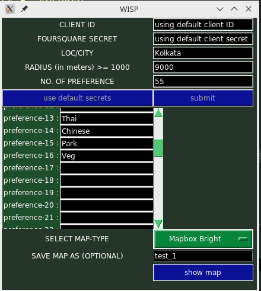

# Wisp : A preference based location finder app


```
██╗    ██╗██╗███████╗██████╗       
██║    ██║██║██╔════╝██╔══██╗       
██║ █╗ ██║██║███████╗██████╔╝        
██║███╗██║██║╚════██║██╔═══╝       
╚███╔███╔╝██║███████║██║                 
 ╚══╝╚══╝ ╚═╝╚══════╝╚═╝     	0.0.8-beta 
                                JIMUT(TM) 
```

## Purpose 

Is it possible to find the best place's hot-spots according to set of some given preferences? In this project we solved the problem of manually asking the locals to find the best place according to the given set of preferences and by using data to find the best place of almost any location. We proposed a software named WISP, which can take the preferences, location, and the radius from that point of location as input and show the hot-spots according to the preferences. 

## Why WISP ?

Now, what is the significance of the name wisp ?

According to any standard dictionary, Wisp means :


So, it is "a bunch of something", in our case it is the bunch of data points, clustered as hotspots. This doesn't uses any advanced machine learning algorithm, but simple ```MarkerCluster()``` algorithm, built-in in Folium map API.

## Video 

[](https://www.youtube.com/watch?v=__q1H-RrCu8&t=0s)

## Scope

This software can be used for any number of preferences and for any location provided the data exists in [FourSquare API](https://foursquare.com/). The reason behind choosing foursquare API is that there is rich availability of data and a good community to update data.

## Survey of Technologies

We have used python3 for building the software from scratch which includes many libraries. We have also used tkinter to build the custom-made GUI. It uses folium to plot the cluster in map, and foursquare API to collect the updated data for cleaning and then plotting.

## Credentials 

Make an account in [Foursquare](https://foursquare.com/) to get the key and ID, which is used for this application to fetch the data.

## Installation

```
$ git clone https://github.com/Jimut123/wisp
$ cd wisp
$ sudo pip install -r requirements.txt
$ sudo python setup.py install
$ wisp -h
usage: wisp [-h] [-q] [-t {1,2,3}] [-v]

optional arguments:
  -h, --help            show this help message and exit
  -q, --quiet           will not display anything in the terminal
  -t {1,2,3}, --theme {1,2,3}
                        to select theme [1] classic [2] light [3] dark
  -v, -V, --version     displays version
```


## Libraries used

The libraries needed to be installed before the use of WISP is given in [requirements.txt](requirements.txt)
```
requests==2.21.0
pandas==0.24.1
folium==0.7.0
geopy==1.18.1
numpy==1.16.1
wget==3.2
datetime
IPython
```

## Features

* *WISP* comes in 3 themes :


<table border="1px" align="center">
    <tr>
        <td align="center">
            
        </td>
        <td align="center">
            
        </td align="center">
        <td>
            
        </td>
    </tr>
    <tr>
        <td align="center">
             -t 1
        </td>
        <td align="center">
             -t 2
        </td>
        <td align="center">
             -t 3
        </td>
    </tr>
</table>

* *WISP* have 5 maps, we can visualise it in any one of the five maps

<table border="1px">
    <tr>
        <td align="center"> Mapbox Bright </td>
    </tr>
    <tr>
        <td align="center"> Stamen Toner </td>
    </tr>
    <tr>
        <td align="center"> Stamen Terrain </td>
    </tr>
    <tr>
        <td align="center"> OpenStreetMap </td>
    </tr>
    <tr>
        <td align="center"> Mapbox Control Room </td>
    </tr>
</table>

* We can save the map for later use by giving the name in 'save map as' entry.

* We can pass optional arguments to keep the terminal clean ``` -q``` for quiet running of application.

* We can also use a file named as [secrets.txt](secrets.txt), to store the foursquare ID and client ID in the folder where you are running the wisp application, so that you don't have to type this again and again, and use the button "use default secrets" to fill up the client ID and foursquare ID automatically. It is a simple JSON file, and just have to store the ID and secrets without any spaces.


