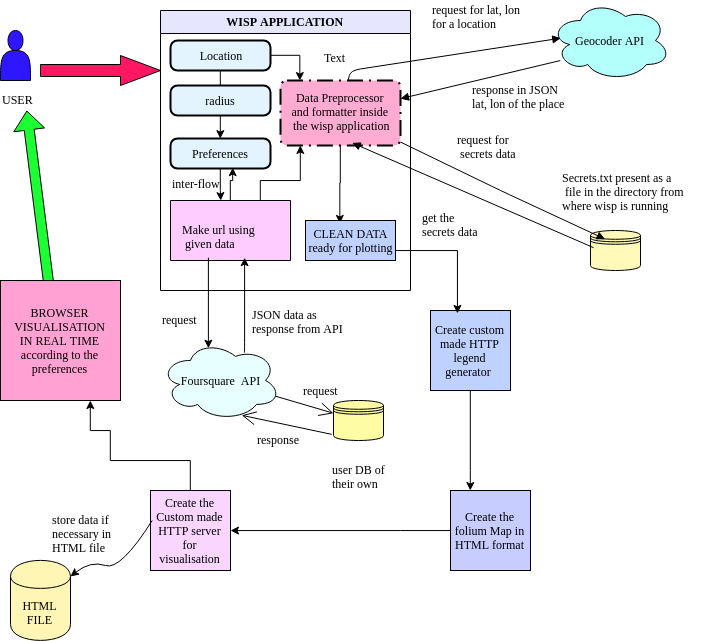

# Summary

If we want to visit a place, which is unknown and want to find the best place according to our preferences (focussing that place), this application will help to do that in real time without manually researching about that place. This application uses foursquare api along with folium map [@Folium] to generate visualisation of user's choice. This generates the map and visualises it in real time using custom made HTTP server, which can be saved for later use. This also comes in three themes and we have build a command line interface for the whole application which can be found in the repository website of this software.

# Figures

-

# Acknowledgements

I acknowledge the help received from my father, Dr. Jadab Kumar Pal, for constantly supporting me to complete this project.

# References
